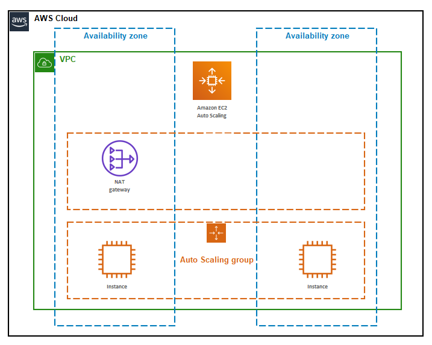

# Load-balanced website served from AWS

The goal of this setup is to have a a fully qualified domain name that points to a load balancer that distributes incoming traffic across 2 EC2 instances that are running httpd and reply only their corresponding private IP.

The setup includes:
- 4 subnets (2 public and 2 private)
- Nat Gateway for outbound connections and a Internet Gateway
- Application Load Balancer
- Autoscaling group
- EC2 Instance launch template
- A route53 record and a ACM certificate



## How to run
```
export AWS_ACCESS_KEY_ID="anaccesskey"
export AWS_SECRET_ACCESS_KEY="asecretkey"
terraform init
terraform apply
```
Access https://andre.code.studucu.com (or change the variable subdomain on variables.tf for different address)
The ec2 instances ssh access key is output as well
